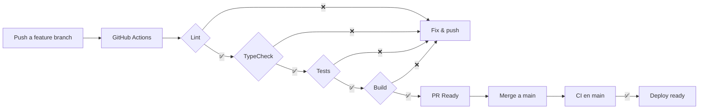

# BarberSchool — Plan de Desarrollo

## Visión general

Este plan divide el desarrollo de BarberSchool en **6 fases incrementales**. Cada fase produce entregables funcionales, commits atómicos y pasa el pipeline CI/CD antes de merge a `main`.

**Principio rector:** cada fase termina con CI verde → merge a `main` → tag opcional.

---

## Fase 0 — Fundación ✅

**Objetivo:** Repositorio listo con CI/CD, scaffold Expo y documentación.

| Tarea | Entregable | Estado |
|-------|-----------|--------|
| Especificaciones técnicas | `docs/SPECIFICATIONS.md` | ✅ |
| Plan de desarrollo | `docs/DEVELOPMENT_PLAN.md` | ✅ |
| Kit de documentación | `docs/README.md`, `REGISTRY.md`, etc. | ✅ |
| Scaffold Expo + TypeScript | `package.json`, `app/`, `src/` | ✅ |
| Pipeline CI/CD | `.github/workflows/ci.yml` | ✅ |
| README actualizado | `README.md` | ✅ |
| Config lint/test | ESLint, Prettier, Jest | ✅ |

**Criterio de done:** ✅ Completado — ver [phases/PHASE_0.md](phases/PHASE_0.md)

**Commits realizados:**
1. `docs: add specifications and development plan`
2. `chore: scaffold expo project with typescript`
3. `ci: add github actions pipeline`
4. `docs: update README with setup and CI instructions`
5. `docs: add documentation kit with registry and status tracking`

---

## Fase 1 — Modelo de datos y almacenamiento local

**Objetivo:** SQLite operativo con esquema completo y servicios de persistencia.

| Tarea | Detalle |
|-------|---------|
| Schema SQLite | Tablas: sessions, photos, flow_steps, decision_cards, card_responses |
| Migraciones | Sistema de versionado de schema |
| StorageService | CRUD genérico sobre SQLite |
| PhotoService | Guardar/leer fotos en filesystem + registrar en DB |
| Datos seed | 5 tipos de corte con flujos y tarjetas predefinidos |
| Tests unitarios | StorageService, PhotoService, migraciones |

**Archivos clave:**
- `src/db/schema.ts`
- `src/db/migrations/`
- `src/services/StorageService.ts`
- `src/services/PhotoService.ts`
- `src/data/haircutTypes.ts`

**Criterio de done:** Tests de persistencia pasan; datos seed cargan al iniciar app.

**Commits:**
1. `feat(db): add sqlite schema and migrations`
2. `feat(services): add storage and photo services`
3. `feat(data): add predefined haircut types and flows`
4. `test: add unit tests for storage layer`

---

## Fase 2 — Navegación y pantallas base

**Objetivo:** Estructura de navegación y pantallas estáticas conectadas a datos.

| Tarea | Detalle |
|-------|---------|
| Expo Router setup | Tabs: Home, Historial, Configuración |
| Home screen | Grid de tipos de corte, botón nueva sesión |
| Crear sesión | Selección de tipo → crear en DB → navegar a flujo |
| Historial | Lista de sesiones con fecha, tipo, status |
| Settings | Tema claro/oscuro |
| Zustand stores | sessionStore, settingsStore |

**Archivos clave:**
- `app/(tabs)/index.tsx`
- `app/(tabs)/history.tsx`
- `app/(tabs)/settings.tsx`
- `app/session/new.tsx`
- `src/stores/sessionStore.ts`

**Criterio de done:** Navegación funcional; crear sesión persiste y aparece en historial.

**Commits:**
1. `feat(nav): setup expo router with tab navigation`
2. `feat(home): add haircut type selection screen`
3. `feat(history): add session history list`
4. `feat(settings): add theme toggle`

---

## Fase 3 — Flujo guiado de corte

**Objetivo:** Experiencia paso a paso para realizar un corte.

| Tarea | Detalle |
|-------|---------|
| Flow screen | Mostrar paso actual con progreso |
| Navegación pasos | Anterior / Completar / Siguiente |
| Checklist visual | Pasos completados vs pendientes |
| Pantalla referencia | Imagen de referencia fullscreen |
| Completar sesión | Marcar status completed con timestamp |

**Archivos clave:**
- `app/session/[id]/flow.tsx`
- `app/session/[id]/reference.tsx`
- `src/components/FlowStepCard.tsx`
- `src/components/ProgressBar.tsx`
- `src/stores/flowStore.ts`

**Criterio de done:** Flujo completo de 8 pasos navegable; progreso persiste si se sale y vuelve.

**Commits:**
1. `feat(flow): add guided haircut flow screen`
2. `feat(flow): add step navigation and progress tracking`
3. `feat(reference): add reference image viewer`
4. `test: add flow navigation tests`

---

## Fase 4 — Cámara y galería de fotos

**Objetivo:** Captura, almacenamiento y visualización de fotos.

| Tarea | Detalle |
|-------|---------|
| Permisos cámara | Solicitar y manejar denegación |
| Camera screen | Vista previa + botón captura |
| Compresión | Resize a max 1920px, JPEG 80% |
| Guardar local | Filesystem + registro SQLite |
| Galería sesión | Grid de fotos con labels before/during/after |
| Eliminar foto | Swipe o botón eliminar |

**Archivos clave:**
- `app/session/[id]/camera.tsx`
- `src/services/PhotoService.ts` (ampliar)
- `src/components/PhotoGallery.tsx`
- `src/components/CameraView.tsx`

**Criterio de done:** Foto capturada persiste tras reiniciar app; galería muestra fotos por sesión.

**Commits:**
1. `feat(camera): add camera screen with permissions`
2. `feat(camera): add image compression and local storage`
3. `feat(gallery): add session photo gallery`
4. `test: add photo service tests`

---

## Fase 5 — Tarjetas de decisión

**Objetivo:** Autoevaluación con tarjetas al finalizar el corte.

| Tarea | Detalle |
|-------|---------|
| Cards screen | Tarjeta con pregunta + 3 opciones |
| Navegación tarjetas | Swipe o botones entre tarjetas |
| Guardar respuestas | card_responses en SQLite |
| Resumen final | Score y respuestas de la sesión |
| Integración flujo | Transición automática flujo → cámara → tarjetas → resumen |

**Archivos clave:**
- `app/session/[id]/cards.tsx`
- `src/components/DecisionCard.tsx`
- `src/components/SessionSummary.tsx`

**Criterio de done:** Tarjetas responden, guardan y muestran resumen; visible en historial.

**Commits:**
1. `feat(cards): add decision cards screen`
2. `feat(cards): add response persistence and summary`
3. `feat(session): integrate full session flow end-to-end`
4. `test: add decision cards tests`

---

## Fase 6 — Pulido y release

**Objetivo:** App lista para distribución interna (TestFlight / APK).

| Tarea | Detalle |
|-------|---------|
| UI polish | Animaciones, transiciones, iconografía |
| Empty states | Mensajes cuando no hay sesiones/fotos |
| Error handling | Toasts para errores de cámara/storage |
| Accesibilidad | Labels, contraste, tamaños táctiles |
| App icon + splash | Branding BarberSchool |
| EAS Build config | `eas.json` para builds de producción |
| README final | Instrucciones completas de desarrollo y build |

**Criterio de done:** Build de producción genera APK/IPA; app usable end-to-end sin crashes.

**Commits:**
1. `style: polish UI with animations and empty states`
2. `fix: add error handling for camera and storage`
3. `chore: add app icon, splash screen and eas config`
4. `docs: finalize README with build instructions`

---

## Cronograma de CI/CD



### Reglas de merge a `main`

1. Todos los jobs de CI deben pasar (verde).
2. PR con al menos 1 commit descriptivo.
3. No merge directo sin CI (branch protection recomendado en GitHub).
4. Cada fase = 1 PR con commits incrementales.

---

## Métricas de progreso

| Fase | Funcionalidad | % MVP |
|------|--------------|-------|
| 0 | Fundación + CI | 10% |
| 1 | Datos + storage | 25% |
| 2 | Navegación + UI base | 40% |
| 3 | Flujo guiado | 60% |
| 4 | Cámara + fotos | 80% |
| 5 | Tarjetas decisión | 95% |
| 6 | Pulido + release | 100% |

---

## Dependencias entre fases

```
Fase 0 ──→ Fase 1 ──→ Fase 2 ──→ Fase 3 ──→ Fase 5
                              └──→ Fase 4 ──→ Fase 5
                                                    └──→ Fase 6
```

Fase 3 y Fase 4 pueden desarrollarse en paralelo tras Fase 2.

---

## Próximo paso inmediato

Completar **Fase 0**: scaffold Expo, configurar CI/CD, primer push con pipeline verde.
