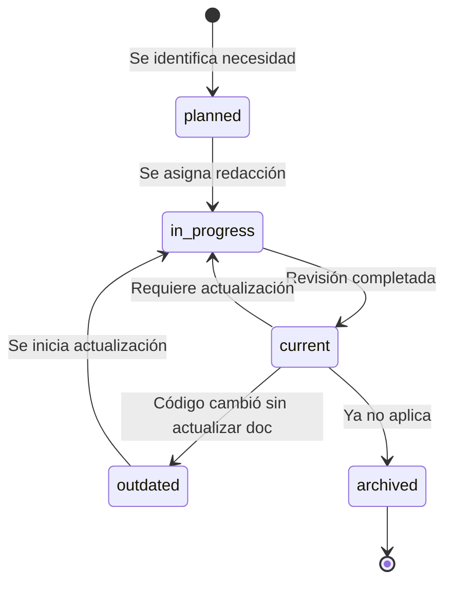

# Guía del Kit de Documentación — BarberSchool

Este documento define **cómo se organiza, mantiene y audita** toda la documentación del proyecto.

---

## 1. Propósito del kit

El kit de documentación garantiza que en todo momento se pueda responder:

1. **¿Qué documentos existen?** → [REGISTRY.md](REGISTRY.md)
2. **¿Cuál es el estado de cada uno?** → Campo `status` en front-matter + REGISTRY
3. **¿Está alineado con el código?** → Campo `sync_with_code`
4. **¿Cuándo se revisó por última vez?** → `last_reviewed` / `next_review`
5. **¿Qué cambió?** → [CHANGELOG.md](CHANGELOG.md)

---

## 2. Estructura de directorios

```
docs/
├── README.md                 # Índice maestro (este kit)
├── DOC_KIT.md                # Esta guía
├── REGISTRY.md               # Registro detallado de estado
├── CHANGELOG.md              # Historial de cambios
│
├── SPECIFICATIONS.md         # Requisitos y specs técnicas
├── DEVELOPMENT_PLAN.md       # Roadmap por fases
├── ARCHITECTURE.md           # Arquitectura del sistema
├── DATA_MODEL.md             # Modelo de datos
├── GLOSSARY.md               # Terminología
├── CONTRIBUTING.md           # Cómo contribuir
├── CI_CD.md                  # Pipeline y despliegue
├── SETUP.md                  # Setup local
│
├── phases/                   # Documento por fase
│   ├── PHASE_0.md
│   └── ...
├── adr/                      # Architecture Decision Records
│   └── README.md
└── templates/                # Plantillas reutilizables
    ├── TEMPLATE_SPEC.md
    ├── TEMPLATE_ADR.md
    └── TEMPLATE_PHASE.md
```

---

## 3. Sistema de identificación (ID)

Cada documento tiene un **ID único** en su front-matter:

| Prefijo | Tipo | Ejemplo |
|---------|------|---------|
| `DOC-0xx` | Gobernanza del kit | DOC-001 |
| `DOC-1xx` | Producto / planificación | DOC-010 |
| `DOC-2xx` | Arquitectura / datos | DOC-020 |
| `DOC-3xx` | Desarrollo / operaciones | DOC-030 |
| `DOC-4xx` | Fases de implementación | DOC-040 |
| `TPL-0xx` | Plantillas | TPL-001 |
| `ADR-0xx` | Decisiones de arquitectura | ADR-001 |

---

## 4. Front-matter obligatorio

Todo documento del kit **debe** incluir este bloque YAML al inicio:

```yaml
---
id: DOC-XXX
title: Título del documento
version: 1.0.0          # Semver: MAJOR.MINOR.PATCH
status: current          # Ver tabla de estados
phase: 0                 # Fase del proyecto (0-6, o "all")
owner: equipo-barberschool
last_updated: YYYY-MM-DD
last_reviewed: YYYY-MM-DD
next_review: YYYY-MM-DD  # Revisión programada (+30 días)
sync_with_code: aligned  # aligned | partial | outdated | n/a
---
```

### 4.1 Estados (`status`)

| Valor | Descripción | Cuándo usar |
|-------|-------------|-------------|
| `current` | Completo y vigente | Documento finalizado y alineado |
| `in_progress` | En redacción | Se está escribiendo o actualizando |
| `planned` | Planificado | Existe en el registro pero sin contenido |
| `outdated` | Desactualizado | El código cambió y el doc no refleja eso |
| `archived` | Archivado | Ya no aplica, se conserva como historial |

### 4.2 Sincronización con código (`sync_with_code`)

| Valor | Descripción |
|-------|-------------|
| `aligned` | Documento refleja fielmente el código actual |
| `partial` | Parcialmente alineado; hay secciones pendientes |
| `outdated` | El código avanzó y el documento no se actualizó |
| `n/a` | No aplica (docs de gobernanza, plantillas, glosario) |

### 4.3 Versionado (`version`)

Seguimos **Semantic Versioning** para documentos:

| Incremento | Cuándo |
|------------|--------|
| **MAJOR** | Cambio estructural o de alcance (ej. rediseño de arquitectura) |
| **MINOR** | Contenido nuevo o secciones añadidas |
| **PATCH** | Correcciones menores, typos, aclaraciones |

---

## 5. Ciclo de vida de un documento



### Checklist al crear un documento

- [ ] Asignar ID único (verificar en REGISTRY.md que no exista)
- [ ] Copiar plantilla adecuada de `templates/`
- [ ] Completar front-matter
- [ ] Redactar contenido
- [ ] Añadir entrada en REGISTRY.md
- [ ] Añadir entrada en CHANGELOG.md
- [ ] Enlazar desde docs/README.md
- [ ] Commit: `docs(DOC-XXX): descripción`

### Checklist al actualizar un documento

- [ ] Actualizar contenido
- [ ] Incrementar `version` según semver
- [ ] Actualizar `last_updated`
- [ ] Verificar y actualizar `sync_with_code`
- [ ] Si la revisión está completa: actualizar `last_reviewed` y `next_review`
- [ ] Registrar cambio en CHANGELOG.md
- [ ] Actualizar fila correspondiente en REGISTRY.md

---

## 6. Revisiones programadas

| Frecuencia | Documentos | Acción |
|------------|-----------|--------|
| **Cada commit** | REGISTRY, CHANGELOG | Actualizar si hubo cambio en docs |
| **Cada fase** | SPECIFICATIONS, DEVELOPMENT_PLAN, fase actual | Revisión completa al cerrar fase |
| **Mensual** | Todos los `current` | Verificar `next_review` en REGISTRY |
| **Al cambiar arquitectura** | ARCHITECTURE, DATA_MODEL, ADRs | Actualización inmediata |

---

## 7. Convenciones de commits para documentación

```
docs(DOC-010): add RF-06 notification requirements
docs(DOC-020): update architecture diagram for sqlite layer
docs: refresh registry and changelog
docs(DOC-040): mark phase 0 as completed
```

---

## 8. Responsabilidades

| Rol | Responsabilidad |
|-----|----------------|
| **Autor del cambio** | Actualizar docs afectados en el mismo PR |
| **Reviewer** | Verificar que docs y código estén alineados |
| **Maintainer** | Auditar REGISTRY mensualmente |
| **CI** | No bloquea por docs, pero el equipo verifica manualmente |

---

## 9. Auditoría rápida

Para saber qué necesita atención, ejecuta mentalmente este filtro sobre [REGISTRY.md](REGISTRY.md):

1. `status = outdated` → **Acción urgente**: actualizar
2. `sync_with_code = outdated` → **Acción urgente**: alinear con código
3. `next_review < hoy` → **Revisión pendiente**
4. `status = planned` → **Pendiente de redacción**
5. `status = in_progress` → **En curso**, verificar avance

---

## 10. Relación con el plan de desarrollo

Cada fase del [plan de desarrollo](DEVELOPMENT_PLAN.md) tiene un documento en `phases/`. Al **iniciar** una fase, su documento pasa de `planned` a `in_progress`. Al **cerrar** la fase con CI verde, pasa a `current`.

Los documentos transversales (SPECIFICATIONS, ARCHITECTURE, etc.) se actualizan según el avance de cada fase.
