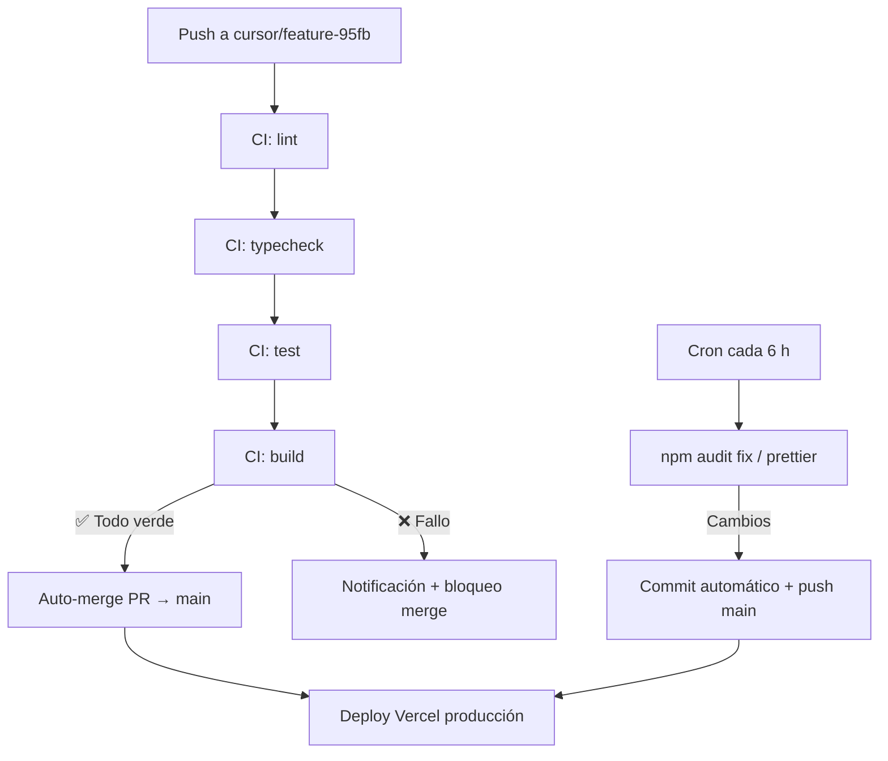

# BarberSchool — Plan de Desarrollo

## Resumen ejecutivo

Este plan define las fases, entregables y cronograma técnico para construir **BarberSchool**, la PWA que ayuda a barberos a documentar cortes, seguir flujos de trabajo y usar imágenes de referencia con marcas guía, con almacenamiento automático en Google Drive.

**Estrategia de entrega:** trunk-based development con ramas `cursor/*`, CI/CD automatizado y merge a `main` solo cuando todos los checks pasen.

---

## Fase 0 — Fundación e infraestructura ✅ (Sprint actual)

**Objetivo:** Repositorio funcional con CI/CD y esqueleto de la aplicación.

### Entregables
- [x] Documento SPECS.md
- [x] Documento PLAN.md
- [ ] Proyecto Next.js 15 + TypeScript + Tailwind
- [ ] PWA manifest básico
- [ ] GitHub Actions: `ci.yml` (lint, typecheck, build)
- [ ] GitHub Actions: `auto-merge.yml` (merge a main si CI pasa)
- [ ] GitHub Actions: `scheduled.yml` (mantenimiento cada 6 h)
- [ ] Pantalla Home con branding BarberSchool
- [ ] Tipos TypeScript base (`src/types/index.ts`)
- [ ] Store Zustand vacío (`src/stores/sesionStore.ts`)

### Criterio de done
- `npm run build` exitoso
- CI verde en GitHub
- PR auto-mergeado a `main`

---

## Fase 1 — Cámara y captura de fotos

**Objetivo:** El barbero puede abrir la cámara y capturar fotos guardadas localmente.

### Tareas
| # | Tarea | Prioridad |
|---|-------|-----------|
| 1.1 | Componente `CameraView` con MediaDevices API | Alta |
| 1.2 | Selección cámara trasera por defecto | Alta |
| 1.3 | Componente `PhotoCapture` con botón grande | Alta |
| 1.4 | Vista previa post-captura (retomar / confirmar) | Alta |
| 1.5 | Guardar JPEG en IndexedDB (`lib/db.ts`) | Alta |
| 1.6 | Compresión JPEG a 85 %, máx 2 MB | Media |
| 1.7 | Pantalla de permisos denegados con instrucciones | Media |
| 1.8 | Tests unitarios de `lib/camera.ts` | Media |

### Entregable
Ruta `/sesion/[id]` con cámara funcional y fotos en IndexedDB.

---

## Fase 2 — Autenticación y Google Drive

**Objetivo:** Fotos se suben automáticamente a Google Drive del barbero.

### Tareas
| # | Tarea | Prioridad |
|---|-------|-----------|
| 2.1 | OAuth 2.0 flow (`/api/auth/google`, `/api/auth/callback`) | Alta |
| 2.2 | Pantalla de login con botón Google | Alta |
| 2.3 | Cliente Drive (`lib/drive.ts`): crear carpeta | Alta |
| 2.4 | Subida multipart de JPEG | Alta |
| 2.5 | Estructura de carpetas `BarberSchool/{año}/{mes}/{sesión}/` | Alta |
| 2.6 | Indicador de progreso de subida | Media |
| 2.7 | Cola offline + reintento (máx 3) | Media |
| 2.8 | Refresh token silencioso | Media |

### Variables de entorno
```env
GOOGLE_CLIENT_ID=
GOOGLE_CLIENT_SECRET=
GOOGLE_REDIRECT_URI=
NEXTAUTH_SECRET=
```

### Entregable
Flujo completo: captura → subida → carpeta visible en Drive.

---

## Fase 3 — Motor de flujos de trabajo

**Objetivo:** El barbero sigue un checklist paso a paso durante el corte.

### Tareas
| # | Tarea | Prioridad |
|---|-------|-----------|
| 3.1 | Modelo `PlantillaFlujo` y 3 plantillas JSON | Alta |
| 3.2 | Componente `WorkflowStepper` con barra de progreso | Alta |
| 3.3 | Navegación: anterior / siguiente / completar paso | Alta |
| 3.4 | Vincular foto capturada al paso actual | Alta |
| 3.5 | Validación: paso con `requiereFoto` bloquea avance | Media |
| 3.6 | Pantalla resumen al completar todos los pasos | Media |
| 3.7 | Home: selector de plantilla antes de iniciar sesión | Alta |
| 3.8 | Notificación de sesión completada | Baja |

### Plantillas iniciales
1. **Fade Clásico** — 5 pasos
2. **Taper Fade** — 6 pasos
3. **Buzz Cut** — 3 pasos

### Entregable
Sesión guiada de principio a fin con fotos etiquetadas por paso.

---

## Fase 4 — Imagen de referencia y marcas guía

**Objetivo:** El barbero superpone una imagen de referencia y coloca marcas guía sobre la cámara.

### Tareas
| # | Tarea | Prioridad |
|---|-------|-----------|
| 4.1 | Componente `ReferenceOverlay` con opacidad ajustable | Alta |
| 4.2 | Cargar imagen desde galería del dispositivo | Alta |
| 4.3 | Imagen de referencia por plantilla (predefinida) | Media |
| 4.4 | Componente `ReferenceMarks` — línea horizontal | Alta |
| 4.5 | Marca tipo punto (círculo) | Media |
| 4.6 | Marca tipo zona (rectángulo) | Media |
| 4.7 | Arrastrar y soltar marcas en viewport | Alta |
| 4.8 | Persistir marcas en sesión (Zustand + IndexedDB) | Alta |
| 4.9 | Modo lado a lado: referencia \| cámara | Media |
| 4.10 | Toggle rápido overlay / marcas desde cámara | Alta |

### Entregable
Cámara con overlay y marcas funcionales, persistidos por sesión.

---

## Fase 5 — Historial, offline y pulido

**Objetivo:** Experiencia completa, robusta y lista para producción.

### Tareas
| # | Tarea | Prioridad |
|---|-------|-----------|
| 5.1 | Service Worker con Workbox (caché assets) | Alta |
| 5.2 | Pantalla historial de sesiones | Alta |
| 5.3 | Enlace a carpeta Drive por sesión | Media |
| 5.4 | Sincronización offline → online automática | Alta |
| 5.5 | Tests E2E Playwright (flujo completo mock) | Media |
| 5.6 | Accesibilidad WCAG 2.1 AA en controles | Media |
| 5.7 | Deploy Vercel con dominio personalizado | Alta |
| 5.8 | Iconos PWA 192/512 px | Media |

### Entregable
App instalable, funcional offline, desplegada en producción.

---

## Pipeline CI/CD — Detalle operativo

### Diagrama de flujo



### Workflows GitHub Actions

#### `ci.yml` — en cada push y PR
```yaml
on: [push, pull_request]
jobs:
  lint → typecheck → test → build
```

#### `auto-merge.yml` — post CI exitoso
```yaml
on:
  check_suite:
    types: [completed]
jobs:
  merge:
    if: check_suite.conclusion == 'success' && head_ref starts with 'cursor/'
    steps: gh pr merge --auto --squash
```

#### `scheduled.yml` — cada 6 horas
```yaml
on:
  schedule:
    - cron: '0 */6 * * *'
jobs:
  maintenance:
    - npm update (minor only)
    - npm run lint --fix
    - commit + push to main if changes
```

### Política de commits automáticos
- Solo actualizaciones de parches y formato (`prettier`, `eslint --fix`).
- Nunca commits automáticos de cambios de lógica de negocio.
- Mensaje: `chore: mantenimiento automático [skip ci]` o con CI según configuración.

---

## Dependencias entre fases

```
Fase 0 (Fundación)
    │
    ▼
Fase 1 (Cámara) ──────────────────────────┐
    │                                        │
    ▼                                        ▼
Fase 2 (Drive)                          Fase 3 (Workflow)
    │                                        │
    └──────────────┬─────────────────────────┘
                   ▼
              Fase 4 (Referencia + Marcas)
                   │
                   ▼
              Fase 5 (Offline + Deploy)
```

Las fases 2 y 3 pueden desarrollarse en paralelo una vez completada la Fase 1.

---

## Métricas de éxito

| Métrica | Objetivo |
|---------|----------|
| Tiempo de captura (abrir app → foto) | < 5 s |
| Tasa de subida exitosa a Drive | > 95 % |
| Sesiones completadas sin abandono | > 70 % |
| CI pass rate | 100 % en main |
| Lighthouse PWA score | > 90 |

---

## Próximos pasos inmediatos

1. ✅ Publicar SPECS y PLAN en `docs/`
2. 🔄 Scaffold Next.js + configurar CI/CD
3. ⏳ Implementar Fase 1 (Cámara) en siguiente iteración
4. ⏳ Configurar credenciales Google Cloud Console para Fase 2
