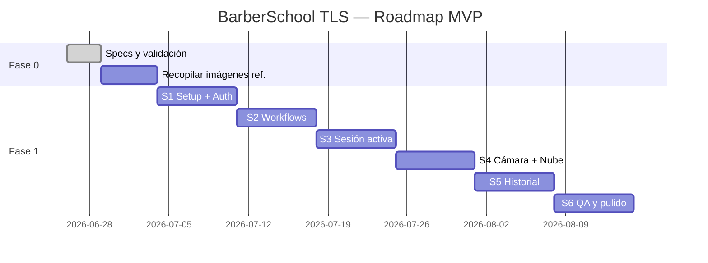
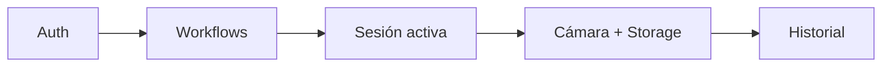

# BarberSchool TLS — Plan de Desarrollo

## Resumen ejecutivo

BarberSchool TLS es una app móvil para que barberos documenten cortes con fotos en la nube y sigan un flujo guiado con imágenes de referencia. Este plan define el orden de trabajo, dependencias y entregables desde cero hasta un MVP publicable.

---

## Objetivo del MVP

Entregar una app móvil donde un barbero pueda:

1. Elegir un tipo de corte (flujo predefinido)
2. Seguir pasos con imágenes de referencia en pantalla
3. Tomar fotos en cada etapa
4. Guardar todo en su nube personal
5. Revisar el historial de sesiones

**Duración estimada del MVP:** 6 sprints (ver desglose abajo)

---

## Estructura del repositorio (propuesta)

```
barberschool/
├── apps/
│   └── mobile/              # Expo React Native
│       ├── src/
│       │   ├── screens/     # Pantallas
│       │   ├── components/  # UI reutilizable
│       │   ├── services/    # API, storage, auth
│       │   ├── hooks/
│       │   ├── navigation/
│       │   └── types/
│       ├── assets/
│       │   └── reference/   # Imágenes mockup de referencia (dev)
│       └── app.json
├── packages/
│   └── shared/              # Tipos y constantes compartidos
├── docs/
│   ├── SPECS.md
│   ├── PLAN.md
│   └── mockups/
├── firebase/                # Reglas, índices (si Firebase)
└── README.md
```

---

## Roadmap visual



---

## Desglose por sprint

### Sprint 1 — Fundación
**Meta:** App navegable con autenticación funcional.

| Tarea | Prioridad |
|-------|-----------|
| Inicializar monorepo / proyecto Expo | P0 |
| Configurar Firebase Auth (o Supabase) | P0 |
| Pantallas: Splash, Login, Register | P0 |
| Navegación: Auth stack + Main stack | P0 |
| Tema visual (colores, tipografía) | P1 |
| Pantalla Home (estática, sin datos) | P1 |

**Entregable:** APK/IPA de desarrollo con login funcional.

---

### Sprint 2 — Flujos de corte
**Meta:** Catálogo de workflows con pasos e imágenes de referencia.

| Tarea | Prioridad |
|-------|-----------|
| Modelo de datos Workflow / WorkflowStep | P0 |
| Seed de 2–3 flujos de ejemplo | P0 |
| API o Firestore: listar y detalle workflows | P0 |
| Pantalla Home con tarjetas de flujos | P0 |
| Pantalla detalle flujo (lista de pasos) | P0 |
| Cargar imágenes de referencia desde CDN/Storage | P0 |

**Entregable:** Usuario ve flujos y pasos con imágenes de referencia.

---

### Sprint 3 — Sesión activa
**Meta:** Experiencia central — guía paso a paso durante el corte.

| Tarea | Prioridad |
|-------|-----------|
| Crear sesión al iniciar flujo | P0 |
| Pantalla sesión activa (mockup 6.2 de SPECS) | P0 |
| Navegación anterior / siguiente paso | P0 |
| Barra de progreso | P0 |
| Campo opcional nombre de cliente | P1 |
| Persistir paso actual en sesión | P0 |

**Entregable:** Simulación completa de un corte sin fotos aún.

---

### Sprint 4 — Cámara y nube
**Meta:** Captura de fotos y almacenamiento en la nube del barbero.

| Tarea | Prioridad |
|-------|-----------|
| Integrar `expo-camera` o `expo-image-picker` | P0 |
| Compresión de imagen antes de subir | P0 |
| Subida a Firebase Storage con ruta por usuario | P0 |
| Asociar foto a paso y sesión en DB | P0 |
| Overlay en cámara con nombre del paso | P1 |
| Indicador de subida / error / reintento | P0 |
| Reglas de seguridad Storage | P0 |

**Entregable:** Fotos guardadas en nube y vinculadas a pasos.

---

### Sprint 5 — Historial y cierre de sesión
**Meta:** Resumen post-corte y consulta de sesiones anteriores.

| Tarea | Prioridad |
|-------|-----------|
| Pantalla resumen al completar último paso | P0 |
| Campo de notas opcionales | P1 |
| Pantalla historial (lista) | P0 |
| Pantalla detalle sesión (fotos por paso) | P0 |
| Eliminar sesión | P2 |
| Pull-to-refresh en historial | P1 |

**Entregable:** Flujo completo de punta a punta.

---

### Sprint 6 — QA, pulido y release interno
**Meta:** App estable para prueba con barberos reales.

| Tarea | Prioridad |
|-------|-----------|
| Pruebas en iOS y Android físicos | P0 |
| Manejo de errores de red | P0 |
| Pantallas de carga y estados vacíos | P1 |
| Onboarding breve (3 slides) | P2 |
| Build TestFlight / Internal Testing | P0 |
| Documentar setup en README | P1 |

**Entregable:** Build de prueba distribuible a 3–5 barberos piloto.

---

## Dependencias críticas



No iniciar Sprint 4 sin Sesión activa (S3) terminada.  
No iniciar Sprint 5 sin Storage funcional (S4).

---

## Contenido necesario antes de desarrollo

| Recurso | Responsable | Cantidad mínima |
|---------|-------------|-----------------|
| Flujos de corte definidos | Instructor / producto | 2 flujos |
| Pasos por flujo | Instructor | 5–8 pasos c/u |
| Imágenes de referencia | Instructor / diseño | 1 imagen por paso |
| Textos de instrucción | Instructor | 1–2 líneas por paso |
| Logo y assets de marca | Diseño | Icono app + splash |

### Flujos sugeridos para MVP

1. **Degradado bajo (Low fade)** — 7 pasos
2. **Taper fade** — 6 pasos
3. **Corte clásico con tijera** — 8 pasos

---

## Decisiones técnicas pendientes

| Decisión | Opciones | Recomendación MVP |
|----------|----------|-------------------|
| Framework móvil | React Native (Expo) vs Flutter | **Expo** — velocidad y cámara |
| Backend | Firebase vs Supabase vs custom | **Firebase** — todo en uno |
| Estado global | Zustand vs Context vs Redux | **Zustand** — simple |
| Navegación | React Navigation | **React Navigation v6** |

---

## Definición de "terminado" (DoD) por tarea

- Código en rama `main` / `develop` con PR revisado
- Funciona en iOS y Android (o solo Android si scope reducido)
- Sin crashes en flujo feliz
- Tipos TypeScript sin `any` innecesarios
- Reglas de seguridad aplicadas si toca Storage/DB

---

## Equipo mínimo sugerido

| Rol | Dedicación MVP |
|-----|----------------|
| Desarrollador móvil | 100% |
| Backend (si no Firebase) | 25% |
| Diseño UI | 25% |
| Producto / barber experto | 10% validación |

---

## Checklist pre-inicio de código

- [ ] SPECS.md revisado y aprobado
- [ ] Al menos 1 flujo completo con imágenes de referencia
- [ ] Cuenta Firebase / Supabase creada
- [ ] Repositorio inicializado
- [ ] Dispositivos de prueba disponibles (1 iOS + 1 Android)

---

## Siguiente acción recomendada

Tras aprobar este plan, el primer commit de código debe ser:

> **Vertical slice:** Login → Home → elegir "Degradado bajo" → pantalla de sesión activa mostrando paso 1 con imagen de referencia estática (sin cámara aún).

Esto valida navegación, diseño y carga de imágenes antes de invertir en integración de cámara y nube.

---

*Plan versión 1.0 — Junio 2026*
