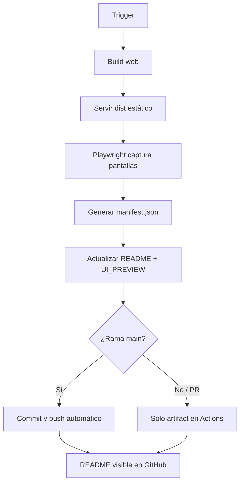

# Workflow de capturas de pantalla

Automatiza la generación de capturas de la interfaz y la actualización del README en GitHub.

---

## 1. Resumen

| Campo | Valor |
|-------|-------|
| **Workflow** | `.github/workflows/screenshots.yml` |
| **Script captura** | `scripts/capture-screenshots.mjs` |
| **Script README** | `scripts/update-readme-screenshots.mjs` |
| **Configuración** | `scripts/screenshots.config.json` |
| **Salida** | `docs/screenshots/*.png` |
| **Docs generados** | `README.md`, `docs/UI_PREVIEW.md` |

---

## 2. Flujo automatizado



---

## 3. Triggers

| Evento | Cuándo | Commit a repo |
|--------|--------|---------------|
| `push` a `main` | Cambios en UI (`app/`, `src/`, `assets/`) | ✅ Sí |
| `workflow_dispatch` | Manual desde Actions | ✅ Solo en `main` |
| `schedule` | Lunes 06:00 UTC | ✅ Sí |
| `pull_request` | PR hacia `main` con cambios UI | ❌ Solo artifact |

---

## 4. Pantallas capturadas

| ID | Ruta | Archivo | Descripción |
|----|------|---------|-------------|
| `home` | `/` | `home.png` | Selección de tipo de corte |
| `history` | `/history` | `history.png` | Historial de sesiones |
| `settings` | `/settings` | `settings.png` | Ajustes |
| `new-session` | `/session/new` | `new-session.png` | Nueva sesión |

Viewport: **390×844** (iPhone 14) @2x

---

## 5. Ejecución local

```bash
# Todo el flujo
npm run screenshots:all

# Paso a paso
npm run build
npm run screenshots
npm run screenshots:update-readme
```

Requisito: Playwright instalado (`npx playwright install chromium`).

---

## 6. Dónde ver las capturas en GitHub

| Ubicación | Qué muestra |
|-----------|-------------|
| **README.md** | Galería embebida con tabla de pantallas |
| **docs/UI_PREVIEW.md** | Vista detallada con metadatos |
| **docs/screenshots/** | PNGs + `manifest.json` |
| **Actions → Artifacts** | Descarga ZIP (PRs y ejecuciones manuales) |

---

## 7. Marcadores en README

El script actualiza solo la sección entre:

```markdown
<!-- SCREENSHOTS:START -->
...contenido generado...
<!-- SCREENSHOTS:END -->
```

No modifica el resto del README.

---

## 8. Añadir nueva pantalla

1. Editar `scripts/screenshots.config.json`:

```json
{
  "id": "camera",
  "path": "/session/abc/camera",
  "title": "Cámara",
  "description": "Captura de fotos del corte"
}
```

2. Ejecutar `npm run screenshots:all`
3. Commit de la nueva config + capturas

---

## 9. Troubleshooting

| Problema | Solución |
|----------|----------|
| Pantalla en blanco | Aumentar `waitAfterNavigationMs` en config |
| Playwright no instalado en CI | Step `npx playwright install chromium --with-deps` |
| README no actualiza | Verificar marcadores `SCREENSHOTS:START/END` |
| Loop infinito de CI | Commit usa `[skip ci]` para no re-disparar pipeline principal |

---

## 10. Referencias

- [CI/CD](CI_CD.md)
- [Vista previa UI](UI_PREVIEW.md)
- [Registro de documentos](REGISTRY.md)
