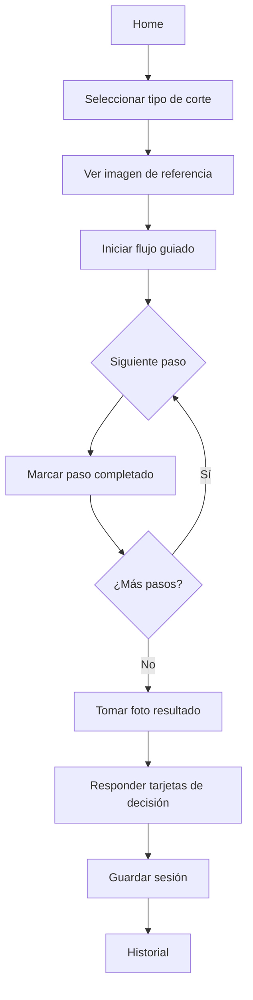
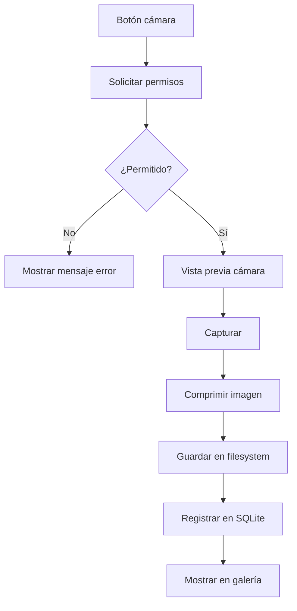

# BarberSchool — Especificaciones Técnicas

## 1. Resumen del producto

**BarberSchool** es una aplicación móvil orientada a barberos en formación y profesionales que necesitan:

1. **Capturar fotos** de cortes realizados y guardarlas **localmente en el dispositivo**.
2. **Seguir un flujo guiado** paso a paso al realizar un corte de cabello.
3. **Consultar imágenes de referencia** y **tarjetas de decisión** (decision cards) durante el proceso.

La app funciona **offline-first**: no requiere conexión a internet para las funciones principales.

---

## 2. Usuarios objetivo

| Rol | Necesidad |
|-----|-----------|
| Barbero aprendiz | Recordar el orden de pasos en cada tipo de corte |
| Barbero profesional | Documentar trabajos con fotos antes/después |
| Instructor | Definir flujos y tarjetas de referencia (fase futura) |

---

## 3. Requisitos funcionales

### RF-01 — Captura y almacenamiento de fotos

- El barbero puede tomar fotos con la cámara del dispositivo.
- Las fotos se guardan en el almacenamiento local del dispositivo (filesystem + base de datos SQLite).
- Cada foto se asocia a una sesión de corte con metadatos: fecha, tipo de corte, notas opcionales.
- El usuario puede ver una galería de fotos por sesión.
- El usuario puede eliminar fotos individualmente.

### RF-02 — Flujos de corte guiados

- La app incluye flujos predefinidos para tipos de corte comunes (fade, taper, buzz cut, etc.).
- Cada flujo es una lista ordenada de pasos con:
  - Título del paso
  - Descripción breve
  - Duración estimada (opcional)
  - Imagen o icono ilustrativo (opcional)
- El barbero puede marcar pasos como completados durante el corte.
- Se muestra progreso visual (barra o checklist).
- Al finalizar, se ofrece capturar foto del resultado.

### RF-03 — Imágenes y tarjetas de referencia

- **Imagen de referencia**: foto de ejemplo del corte objetivo que el barbero puede consultar en pantalla completa mientras trabaja.
- **Tarjeta de decisión (decision card)**: tarjeta visual con criterios de decisión (ej. "¿El degradado es uniforme?", "¿La línea del cuello es limpia?") con opciones Sí/No/Parcial.
- Las tarjetas ayudan al barbero a autoevaluarse antes de dar por terminado el corte.
- Referencias y tarjetas se almacenan localmente (bundled assets + fotos del usuario).

### RF-04 — Gestión de sesiones

- Crear nueva sesión de corte (seleccionar tipo de corte → iniciar flujo).
- Historial de sesiones pasadas con fecha, tipo, fotos y resultado de tarjetas.
- Buscar/filtrar sesiones por tipo de corte o fecha.

### RF-05 — Configuración

- Tema claro/oscuro.
- Idioma: español (por defecto), inglés (fase futura).
- Limpiar caché / exportar fotos (fase futura).

---

## 4. Requisitos no funcionales

| ID | Requisito | Criterio |
|----|-----------|----------|
| RNF-01 | Offline-first | 100% de funciones core sin red |
| RNF-02 | Rendimiento | Captura de foto < 2 s en dispositivos mid-range |
| RNF-03 | Almacenamiento | Fotos comprimidas (JPEG quality 80%, max 1920px) |
| RNF-04 | Privacidad | Datos solo en dispositivo, sin tracking |
| RNF-05 | Accesibilidad | Contraste WCAG AA, tamaños táctiles ≥ 44px |
| RNF-06 | Plataformas | iOS 15+, Android 10+ |

---

## 5. Arquitectura técnica

### 5.1 Stack tecnológico

| Capa | Tecnología | Justificación |
|------|------------|---------------|
| Framework | **Expo SDK 52** (React Native) | Cámara nativa, builds iOS/Android, DX rápida |
| Lenguaje | **TypeScript** | Tipado estático, menos errores |
| Navegación | **Expo Router** (file-based) | Convención moderna Expo |
| Estado | **Zustand** | Ligero, sin boilerplate |
| Persistencia | **expo-sqlite** + **expo-file-system** | SQLite para metadatos, FS para imágenes |
| Cámara | **expo-camera** | API estable multiplataforma |
| UI | **React Native Paper** | Material Design, componentes listos |
| Tests | **Jest** + **@testing-library/react-native** | Unit + component tests |
| Lint | **ESLint** + **Prettier** | Calidad de código |
| CI/CD | **GitHub Actions** | Lint, test, build en cada push |

### 5.2 Diagrama de arquitectura

```
┌─────────────────────────────────────────────────┐
│                   UI Layer                       │
│  Screens: Home, Camera, Flow, Gallery, History │
├─────────────────────────────────────────────────┤
│              State (Zustand stores)              │
│  sessionStore │ flowStore │ photoStore           │
├─────────────────────────────────────────────────┤
│              Services Layer                      │
│  PhotoService │ FlowService │ StorageService     │
├─────────────────────────────────────────────────┤
│              Data Layer                          │
│  SQLite (sessions, steps, cards) │ FileSystem   │
│  (photos/)                       │ (assets/)    │
└─────────────────────────────────────────────────┘
```

### 5.3 Modelo de datos

```typescript
// Sesión de corte
interface HaircutSession {
  id: string;
  haircutTypeId: string;
  startedAt: string;       // ISO 8601
  completedAt?: string;
  notes?: string;
  status: 'in_progress' | 'completed' | 'cancelled';
}

// Foto
interface Photo {
  id: string;
  sessionId: string;
  filePath: string;        // ruta local en filesystem
  takenAt: string;
  label?: 'before' | 'during' | 'after';
}

// Tipo de corte (predefinido)
interface HaircutType {
  id: string;
  name: string;
  description: string;
  referenceImagePath: string;
  flowId: string;
}

// Paso del flujo
interface FlowStep {
  id: string;
  flowId: string;
  order: number;
  title: string;
  description: string;
  estimatedMinutes?: number;
}

// Tarjeta de decisión
interface DecisionCard {
  id: string;
  haircutTypeId: string;
  question: string;
  hint?: string;
  order: number;
}

// Respuesta a tarjeta
interface CardResponse {
  id: string;
  sessionId: string;
  cardId: string;
  answer: 'yes' | 'no' | 'partial';
  answeredAt: string;
}
```

### 5.4 Estructura de directorios

```
barberschool/
├── app/                    # Expo Router screens
│   ├── (tabs)/
│   │   ├── index.tsx       # Home — nueva sesión
│   │   ├── history.tsx     # Historial
│   │   └── settings.tsx    # Configuración
│   ├── session/
│   │   ├── [id]/
│   │   │   ├── flow.tsx    # Flujo guiado
│   │   │   ├── camera.tsx  # Captura de fotos
│   │   │   ├── reference.tsx # Imagen referencia
│   │   │   └── cards.tsx   # Tarjetas decisión
│   │   └── new.tsx         # Crear sesión
│   └── _layout.tsx
├── src/
│   ├── components/         # UI reutilizable
│   ├── stores/           # Zustand stores
│   ├── services/         # Lógica de negocio
│   ├── db/               # SQLite schema + migrations
│   ├── data/             # Flujos y tarjetas predefinidos
│   └── types/            # TypeScript interfaces
├── assets/
│   ├── images/           # Imágenes de referencia bundled
│   └── icons/
├── docs/
│   ├── SPECIFICATIONS.md
│   └── DEVELOPMENT_PLAN.md
├── .github/
│   └── workflows/
│       └── ci.yml
├── package.json
├── tsconfig.json
├── app.json
└── README.md
```

---

## 6. Flujos de usuario (UX)

### 6.1 Flujo principal — Realizar un corte



### 6.2 Flujo — Captura de foto



---

## 7. Pantallas (wireframes conceptuales)

### Home
- Lista de tipos de corte con thumbnail
- Botón "Nueva sesión"
- Acceso rápido a última sesión

### Flujo guiado
- Header con nombre del corte y progreso (3/8)
- Paso actual con título + descripción
- Botones: "Anterior" | "Completar paso" | "Siguiente"
- FAB: cámara rápida | ver referencia

### Cámara
- Vista previa fullscreen
- Selector before/during/after
- Botón captura circular
- Galería miniatura de fotos de la sesión

### Tarjetas de decisión
- Tarjeta con pregunta grande
- Tres botones: ✓ Sí | ~ Parcial | ✗ No
- Indicador de progreso de tarjetas
- Resumen final con score

---

## 8. Datos predefinidos (MVP)

### Tipos de corte iniciales

| ID | Nombre | Pasos | Tarjetas |
|----|--------|-------|----------|
| fade-low | Degradado bajo | 8 | 5 |
| fade-mid | Degradado medio | 8 | 5 |
| taper | Taper clásico | 7 | 4 |
| buzz | Buzz cut | 4 | 3 |
| lineup | Line up / diseño | 6 | 4 |

### Ejemplo de flujo — Degradado bajo

1. Consultar referencia y preparar herramientas
2. Peinar cabello en dirección natural
3. Definir línea base con trimmer (#0)
4. Crear guía con clipper (#1)
5. Fundir zona media (#2 → #3)
6. Detallar contornos con trimmer
7. Afeitar línea del cuello
8. Revisar simetría y aplicar producto

### Ejemplo de tarjetas — Degradado bajo

1. ¿La transición entre números es suave y sin líneas visibles?
2. ¿La línea del cuello es simétrica y limpia?
3. ¿Los contornos laterales están parejos?
4. ¿El largo superior está uniforme?
5. ¿El resultado se parece a la imagen de referencia?

---

## 9. CI/CD

### Pipeline (`.github/workflows/ci.yml`)

```
Push/PR → Lint → TypeCheck → Unit Tests → Build Check → ✅/❌
```

| Job | Comando | Bloquea merge |
|-----|---------|---------------|
| lint | `npm run lint` | Sí |
| typecheck | `npm run typecheck` | Sí |
| test | `npm run test -- --ci` | Sí |
| build | `npx expo export --platform web` | Sí |

### Política de ramas

- `main`: rama protegida, solo recibe merges cuando CI pasa.
- Feature branches: `cursor/<descripcion>-d2f6`
- Commits incrementales cada funcionalidad completada.
- PR obligatorio con status checks verdes antes de merge a `main`.

---

## 10. Criterios de aceptación (MVP)

- [ ] El barbero puede crear una sesión seleccionando un tipo de corte
- [ ] El flujo guiado muestra pasos y permite marcarlos como completados
- [ ] La cámara captura fotos y las guarda localmente
- [ ] Las fotos persisten tras cerrar y reabrir la app
- [ ] La imagen de referencia se muestra en pantalla completa
- [ ] Las tarjetas de decisión se responden y guardan
- [ ] El historial muestra sesiones pasadas con fotos
- [ ] La app funciona sin conexión a internet
- [ ] CI pasa: lint + tests + build en cada push

---

## 11. Fuera de alcance (MVP)

- Sincronización en la nube
- Cuentas de usuario / autenticación
- Panel de instructor web
- Compartir fotos en redes sociales
- Pagos / suscripciones
- Reconocimiento de imagen con IA

---

## 12. Riesgos y mitigaciones

| Riesgo | Impacto | Mitigación |
|--------|---------|------------|
| Permisos de cámara denegados | Alto | UX clara con instrucciones para habilitar |
| Almacenamiento lleno | Medio | Compresión agresiva + aviso al usuario |
| Diferencias iOS/Android cámara | Medio | Testing en ambas plataformas, expo-camera |
| SQLite migrations | Bajo | Versionado de schema desde el inicio |
