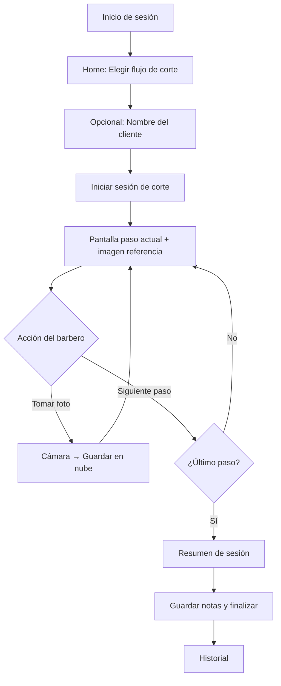
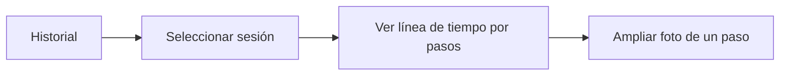
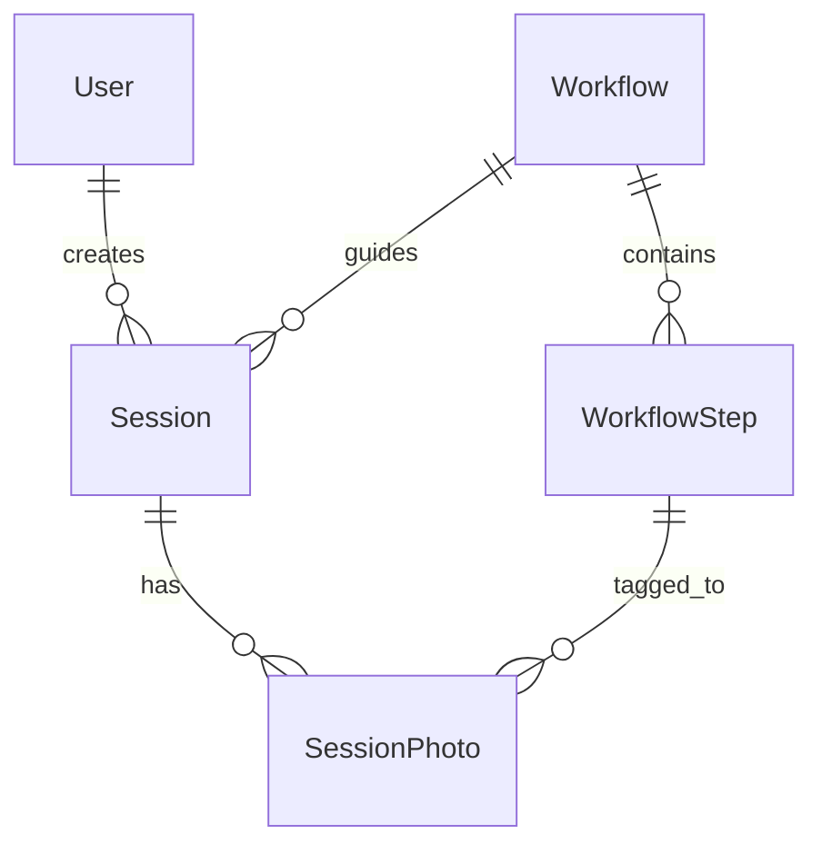
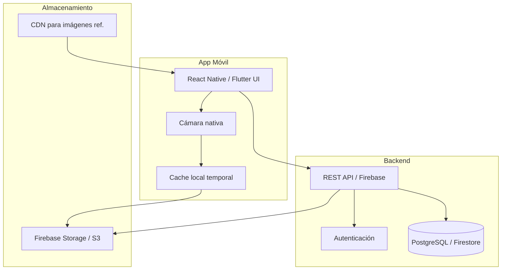

# BarberSchool TLS — Especificaciones de Desarrollo

> **TLS** = *Tool for Learning & Service* (Herramienta de Aprendizaje y Servicio para barberos)

## 1. Visión del producto

BarberSchool TLS es una aplicación móvil orientada a barberos en formación y profesionales que necesitan **documentar cortes**, **seguir un flujo de trabajo estandarizado** y **consultar imágenes de referencia** mientras atienden a un cliente.

El barbero puede tomar fotos durante el servicio, guardarlas automáticamente en su nube personal, y ver en pantalla el paso a paso del corte con imágenes de referencia (mockups) que le recuerdan qué hacer en cada etapa.

---

## 2. Problema que resuelve

| Problema actual | Solución TLS |
|-----------------|--------------|
| Los aprendices olvidan el orden de pasos en un corte | Flujo guiado paso a paso con checklist visual |
| No hay registro visual del progreso del cliente | Fotos por etapa guardadas en la nube |
| Las referencias están en libros o PDFs difíciles de consultar en la silla | Galería de imágenes de referencia integrada en la app |
| No hay historial del trabajo realizado | Álbum por cliente/sesión con fecha y notas |

---

## 3. Usuarios y roles

### 3.1 Barbero (usuario principal)
- Inicia sesión con su cuenta
- Selecciona o crea un flujo de corte
- Toma fotos durante el servicio
- Consulta imágenes de referencia por paso
- Revisa su historial de sesiones

### 3.2 Instructor / Admin (fase 2)
- Crea y edita flujos de corte (plantillas)
- Sube imágenes de referencia oficiales
- Revisa el trabajo de los estudiantes

---

## 4. Alcance del MVP (Fase 1)

### 4.1 Funcionalidades incluidas

1. **Autenticación**
   - Registro e inicio de sesión (email + contraseña)
   - Recuperación de contraseña

2. **Flujos de corte (workflows)**
   - Lista de plantillas predefinidas (ej: *Degradado bajo*, *Taper fade*, *Buzz cut*)
   - Cada flujo tiene N pasos ordenados
   - Cada paso incluye: título, descripción breve, imagen de referencia, duración estimada

3. **Modo sesión activa**
   - Pantalla principal durante el corte
   - Paso actual destacado con imagen de referencia grande
   - Botones: *Anterior* | *Siguiente paso* | *Tomar foto*
   - Indicador de progreso (ej: Paso 3 de 7)

4. **Captura y almacenamiento de fotos**
   - Cámara nativa integrada
   - Foto asociada al paso actual y a la sesión
   - Subida automática a nube del barbero (Firebase Storage / S3)
   - Compresión ligera antes de subir (máx. 1–2 MB por foto)

5. **Historial de sesiones**
   - Lista de sesiones por fecha
   - Detalle: flujo usado, fotos por paso, notas opcionales
   - Vista galería y línea de tiempo

6. **Perfil básico**
   - Nombre, foto de perfil
   - Espacio usado en nube

### 4.2 Fuera del MVP (Fase 2+)

- Creación de flujos personalizados por el barbero
- Panel web para instructores
- Compartir sesión con instructor para revisión
- Notificaciones push
- Modo offline con sincronización posterior
- Integración con catálogo de productos / marcas

---

## 5. Flujos de usuario

### 5.1 Flujo principal: realizar un corte con guía



### 5.2 Flujo: revisar historial



---

## 6. Pantallas y mockups de referencia

### 6.1 Mapa de pantallas

| # | Pantalla | Descripción |
|---|----------|-------------|
| 1 | Splash / Login | Logo BarberSchool, campos email/contraseña |
| 2 | Home | Tarjetas de flujos disponibles + botón "Historial" |
| 3 | Detalle flujo | Lista de pasos con miniaturas de referencia |
| 4 | Sesión activa | **Pantalla clave** — ver sección 6.2 |
| 5 | Cámara | Overlay con nombre del paso actual |
| 6 | Resumen sesión | Grid de fotos tomadas + campo notas |
| 7 | Historial | Lista cronológica de sesiones |
| 8 | Detalle sesión | Fotos agrupadas por paso |

### 6.2 Mockup: Pantalla de sesión activa (referencia)

```
┌─────────────────────────────────────┐
│  ◀ Salir          Degradado bajo    │
├─────────────────────────────────────┤
│         Paso 3 de 7                 │
│  ████████░░░░░░░░  43%              │
├─────────────────────────────────────┤
│                                     │
│   ┌─────────────────────────────┐   │
│   │                             │   │
│   │   [IMAGEN DE REFERENCIA]    │   │
│   │   Vista lateral - línea 2   │   │
│   │                             │   │
│   └─────────────────────────────┘   │
│                                     │
│   Definir línea del degradado       │
│   Usar peine #2, movimiento         │
│   ascendente desde la nuca.         │
│                                     │
├─────────────────────────────────────┤
│  ◀ Anterior    📷 Foto    Siguiente ▶│
└─────────────────────────────────────┘
```

### 6.3 Mockup: Resumen de sesión

```
┌─────────────────────────────────────┐
│  ✓ Sesión completada                │
│  Degradado bajo — 26 jun 2026       │
├─────────────────────────────────────┤
│  Paso 1    Paso 2    Paso 3         │
│  [foto]    [foto]    [foto]         │
│  Paso 4    Paso 5    Paso 6         │
│  [foto]    [ — ]     [foto]         │
├─────────────────────────────────────┤
│  Notas:                             │
│  ┌─────────────────────────────┐    │
│  │ Cliente con cabello grueso... │    │
│  └─────────────────────────────┘    │
│         [ Guardar y cerrar ]        │
└─────────────────────────────────────┘
```

### 6.4 Paleta y estilo visual (referencia)

| Elemento | Valor |
|----------|-------|
| Color primario | `#1A1A2E` (negro barbería) |
| Acento | `#C9A227` (dorado / navaja) |
| Fondo | `#F5F5F5` |
| Tipografía | Inter o SF Pro |
| Iconografía | Lucide / Material Symbols |

---

## 7. Modelo de datos

### 7.1 Entidades

```
User
├── id: UUID
├── email: string
├── displayName: string
├── avatarUrl: string?
├── createdAt: timestamp
└── storageUsedBytes: number

Workflow (plantilla de flujo)
├── id: UUID
├── name: string                    // "Degradado bajo"
├── description: string
├── thumbnailUrl: string
├── estimatedMinutes: number
├── isOfficial: boolean
├── createdBy: userId?
└── steps: WorkflowStep[]

WorkflowStep
├── id: UUID
├── workflowId: UUID
├── order: number                   // 1, 2, 3...
├── title: string                   // "Marcar línea base"
├── instruction: string             // Texto guía
├── referenceImageUrl: string       // Imagen mockup de referencia
└── estimatedMinutes: number?

Session (sesión de corte en curso o completada)
├── id: UUID
├── userId: UUID
├── workflowId: UUID
├── clientName: string?             // Opcional
├── status: enum [in_progress, completed]
├── startedAt: timestamp
├── completedAt: timestamp?
├── notes: string?
└── photos: SessionPhoto[]

SessionPhoto
├── id: UUID
├── sessionId: UUID
├── stepId: UUID
├── storageUrl: string              // URL en nube
├── thumbnailUrl: string
├── takenAt: timestamp
└── metadata: { width, height, sizeBytes }
```

### 7.2 Relaciones



---

## 8. Arquitectura técnica

### 8.1 Diagrama de alto nivel



### 8.2 Stack tecnológico recomendado

| Capa | Tecnología | Justificación |
|------|------------|---------------|
| **App móvil** | React Native (Expo) | Cámara, multiplataforma iOS/Android, ecosistema maduro |
| **Alternativa** | Flutter | Mejor rendimiento UI, buena cámara con `camera` package |
| **Backend** | Firebase (MVP rápido) | Auth + Firestore + Storage en un solo servicio |
| **Alternativa backend** | Supabase o Node.js + PostgreSQL | Más control, SQL relacional |
| **Almacenamiento fotos** | Firebase Storage / AWS S3 | Escalable, URLs firmadas |
| **Imágenes de referencia** | CDN estático (Firebase Hosting) | Carga rápida, no cambian seguido |
| **CI/CD** | GitHub Actions + EAS Build | Builds automáticos para TestFlight / Play Store |

**Recomendación para MVP:** Expo (React Native) + Firebase.

---

## 9. API — Endpoints principales

| Método | Ruta | Descripción |
|--------|------|-------------|
| `POST` | `/auth/register` | Registro |
| `POST` | `/auth/login` | Login → JWT |
| `GET` | `/workflows` | Listar flujos disponibles |
| `GET` | `/workflows/:id` | Detalle con pasos e imágenes ref. |
| `POST` | `/sessions` | Iniciar nueva sesión |
| `PATCH` | `/sessions/:id` | Actualizar paso actual, notas, estado |
| `POST` | `/sessions/:id/photos` | Subir foto (multipart) |
| `GET` | `/sessions` | Historial del usuario |
| `GET` | `/sessions/:id` | Detalle sesión con fotos |
| `DELETE` | `/sessions/:id` | Eliminar sesión |

---

## 10. Requisitos no funcionales

| Requisito | Objetivo |
|-----------|----------|
| Tiempo de carga pantalla sesión | < 2 s con imagen de referencia |
| Subida de foto | < 5 s en 4G con compresión |
| Disponibilidad backend | 99.5% |
| Privacidad | Fotos privadas por usuario; sin acceso cruzado |
| Tamaño app | < 50 MB instalación base |
| Soporte OS | iOS 15+, Android 10+ |

---

## 11. Seguridad y privacidad

- Autenticación con tokens JWT o Firebase Auth
- Reglas de Storage: cada usuario solo accede a `users/{userId}/sessions/{sessionId}/*`
- Fotos de clientes: considerar consentimiento explícito (checkbox al iniciar sesión)
- HTTPS obligatorio en todas las comunicaciones
- No almacenar datos biométricos ni información médica

---

## 12. Plan de desarrollo por fases

### Fase 0 — Preparación (actual)
- [x] Definir specs y mockups de referencia
- [ ] Validar flujos de corte con 1–2 barberos reales
- [ ] Recopilar 3–5 sets de imágenes de referencia por flujo
- [ ] Elegir stack definitivo

### Fase 1 — MVP Core (4–6 sprints)
| Sprint | Entregable |
|--------|------------|
| S1 | Proyecto base, auth, navegación, pantallas estáticas |
| S2 | CRUD workflows + carga de imágenes de referencia |
| S3 | Modo sesión activa (navegación entre pasos) |
| S4 | Integración cámara + subida a nube |
| S5 | Historial y detalle de sesión |
| S6 | QA, pulido UI, pruebas en dispositivo real |

### Fase 2 — Instructor y personalización
- Panel web para crear flujos
- Flujos personalizados del barbero
- Compartir sesión con instructor

### Fase 3 — Escala
- Modo offline
- Analíticas de uso
- Publicación App Store / Play Store

---

## 13. Criterios de aceptación del MVP

1. Un barbero puede registrarse, iniciar sesión y cerrar sesión.
2. Puede elegir un flujo de corte con al menos **3 pasos** e **imágenes de referencia**.
3. Durante el corte, ve el paso actual con imagen de referencia y puede avanzar/retroceder.
4. Puede tomar al menos **1 foto por paso** y esta se guarda en su nube.
5. Al finalizar, ve un resumen con todas las fotos tomadas.
6. Puede consultar el historial de sesiones anteriores con fotos visibles.
7. Las fotos de un usuario **no son visibles** para otro usuario.

---

## 14. Riesgos y mitigaciones

| Riesgo | Mitigación |
|--------|------------|
| Conexión lenta en el salón | Cola de subida en background; indicador de sincronización |
| Imágenes de referencia de baja calidad | Guía de captura para instructores; resolución mínima 800×800 |
| Abandono de la app por fricción | Máximo 2 taps para iniciar un corte desde Home |
| Privacidad del cliente | Aviso de consentimiento; opción de borrar sesión |

---

## 15. Métricas de éxito (post-lanzamiento)

- Sesiones completadas por usuario / semana
- Fotos tomadas por sesión (objetivo: ≥ 1 por paso)
- Tasa de retención a 7 días
- Tiempo promedio en modo sesión activa

---

## 16. Próximos pasos inmediatos

1. **Validar este documento** con el equipo / barberos piloto
2. **Definir 2–3 flujos iniciales** con pasos e imágenes de referencia reales
3. **Inicializar repositorio** con Expo + Firebase
4. **Implementar pantalla de sesión activa** como primera vertical slice
5. **Prueba en dispositivo** con un corte simulado de principio a fin

---

*Documento versión 1.0 — BarberSchool TLS — Junio 2026*
