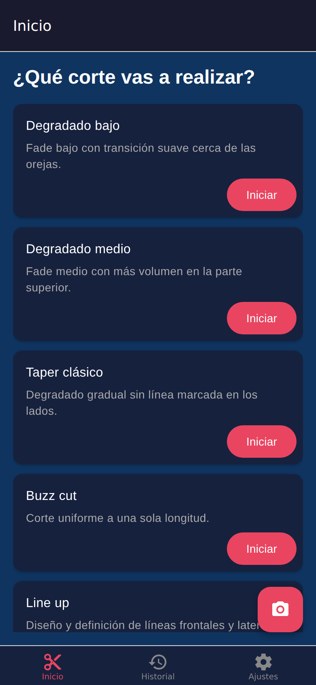
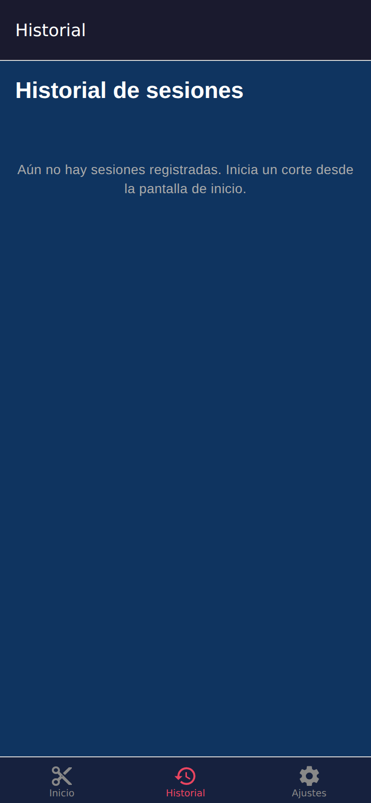
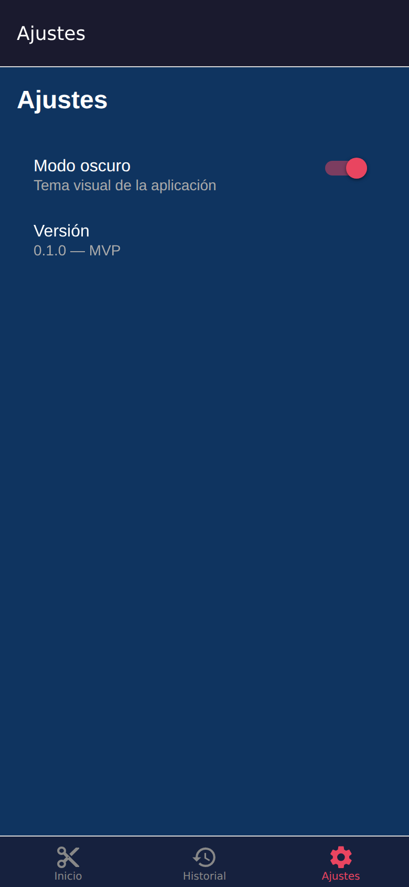
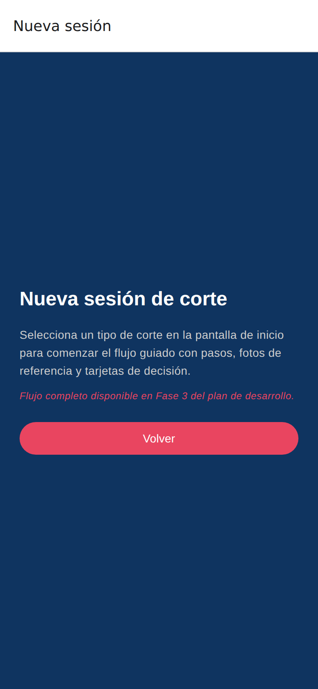

# Vista previa de la interfaz — BarberSchool

> Documento generado automáticamente por el workflow de capturas de pantalla.

| Campo | Valor |
|-------|-------|
| **Generado** | 2026-08-17T06:39:07.257Z |
| **Viewport** | 390×844 (@2x) |
| **Plataforma** | Web export (Expo) |
| **Workflow** | [.github/workflows/screenshots.yml](../.github/workflows/screenshots.yml) |

---

## Pantallas capturadas

## Inicio

| | |
|---|---|
| **Ruta** | `/` |
| **Descripción** | Selección del tipo de corte a realizar |
| **Archivo** | [`docs/screenshots/home.png`](../docs/screenshots/home.png) |




## Historial

| | |
|---|---|
| **Ruta** | `/history` |
| **Descripción** | Registro de sesiones de corte anteriores |
| **Archivo** | [`docs/screenshots/history.png`](../docs/screenshots/history.png) |




## Ajustes

| | |
|---|---|
| **Ruta** | `/settings` |
| **Descripción** | Configuración de la aplicación |
| **Archivo** | [`docs/screenshots/settings.png`](../docs/screenshots/settings.png) |




## Nueva sesión

| | |
|---|---|
| **Ruta** | `/session/new` |
| **Descripción** | Inicio de una nueva sesión de corte |
| **Archivo** | [`docs/screenshots/new-session.png`](../docs/screenshots/new-session.png) |




---

## Cómo actualizar estas capturas

```bash
npm run build
npm run screenshots
npm run screenshots:update-readme
```

En CI, el workflow `screenshots.yml` ejecuta estos pasos y actualiza el README en `main` cuando hay cambios visuales.
