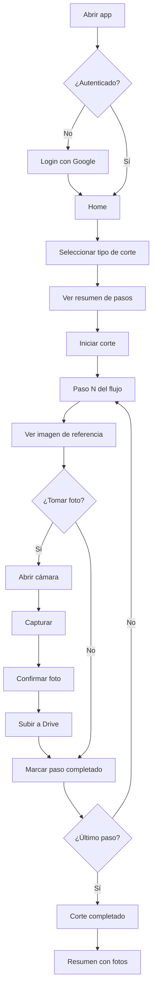
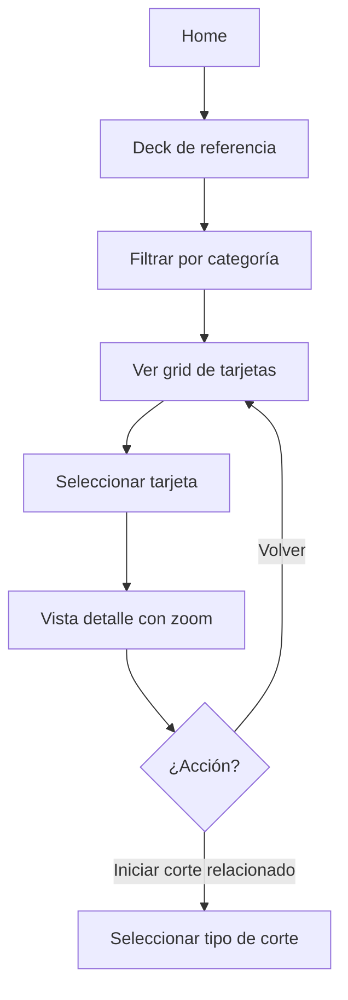
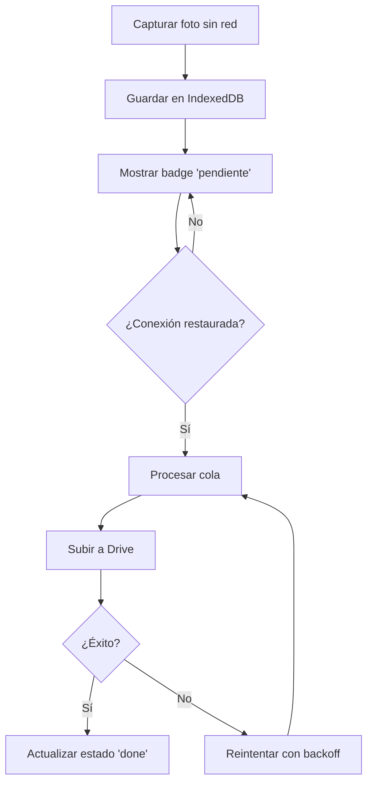
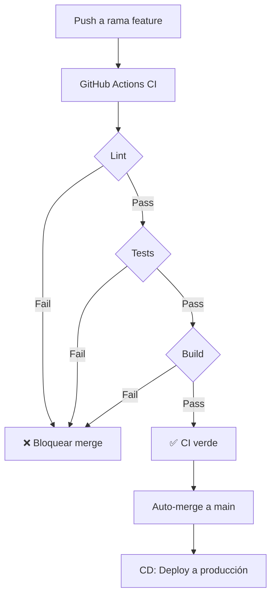

# BarberSchool — Flujos de Usuario

## Flujo 1: Realizar un corte con fotos



## Flujo 2: Consultar deck de referencia



## Flujo 3: Subida offline → online



## Flujo 4: CI/CD (desarrollo)



## Estados de una sesión de corte

| Estado | Descripción | Acciones disponibles |
|--------|-------------|---------------------|
| `in_progress` | Corte activo | Avanzar, retroceder, foto, pausar |
| `paused` | Pausado temporalmente | Reanudar, cancelar |
| `completed` | Finalizado | Ver resumen, compartir |

## Navegación principal

```
┌─────────────────────────────────────┐
│  🏠 Home  │  ✂️ Cortes  │  📚 Deck  │
└─────────────────────────────────────┘
```

- **Home**: Dashboard, sesión activa, accesos rápidos
- **Cortes**: Catálogo y flujo guiado
- **Deck**: Galería de referencia
